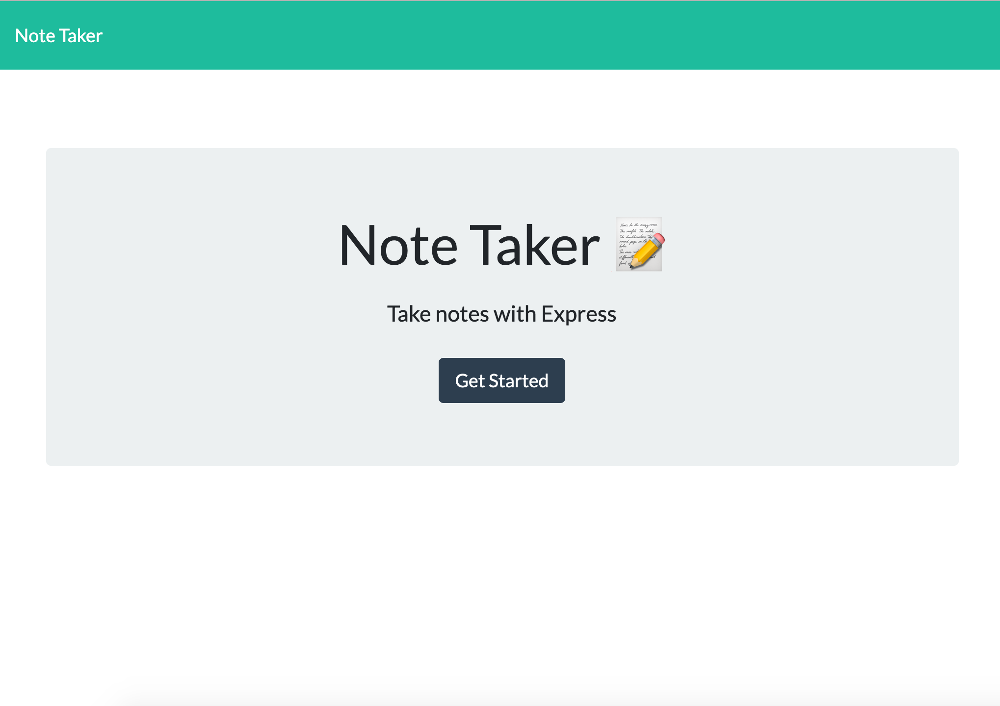

# Note Taker App

This is a web app that allows you to take notes, save those notes, and edit and add to them at a later date.

**Link to GitHub Repo:** https://github.com/rachealcolbert/note-taker

**Screenshot of Application:**

## Description

When a user opens the application, they are presented with a landing page with a link to the notes page. When they click the link, that are taken to a page with previously submitted notes.

Users can then choose to edit previously submitted notes or create a new note. After a user edits an old note or adds a new note, they can save their progress to return and view at a latter time.

## Credits

The creator of this project's email and GitHub is below.

- [GitHub](https://github.com/rachealcolbert)
- rachealcolbert16@gmail.com

## Contributing

No contributions are needed on this project.
